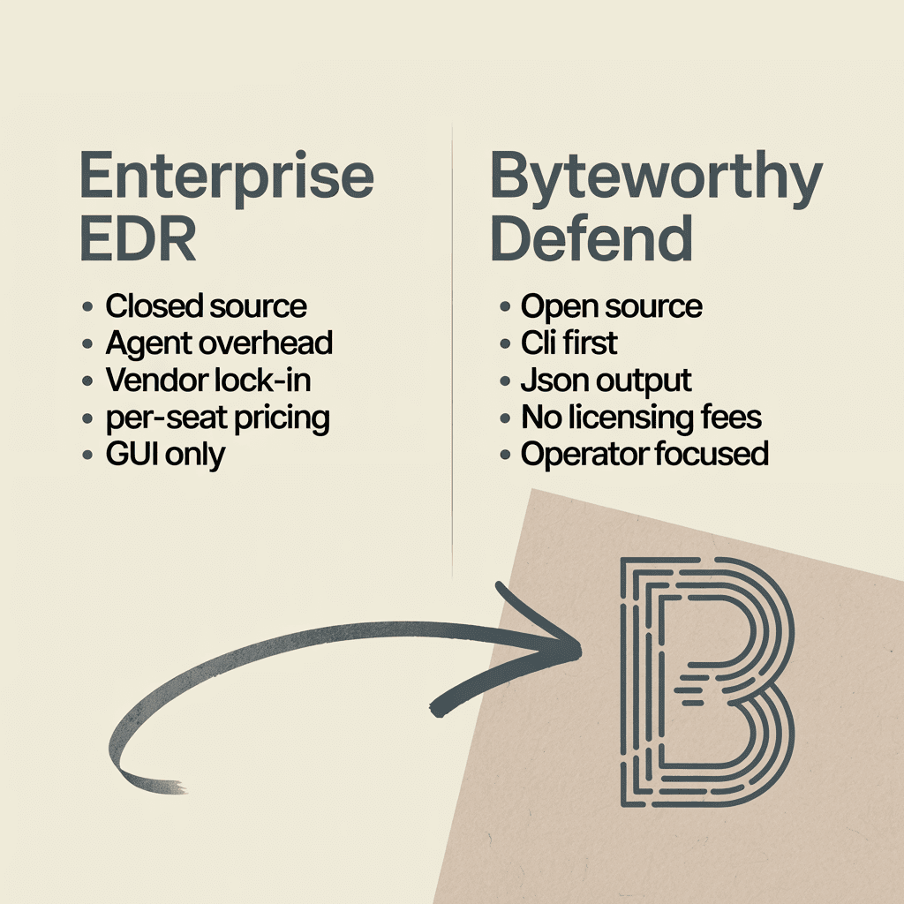
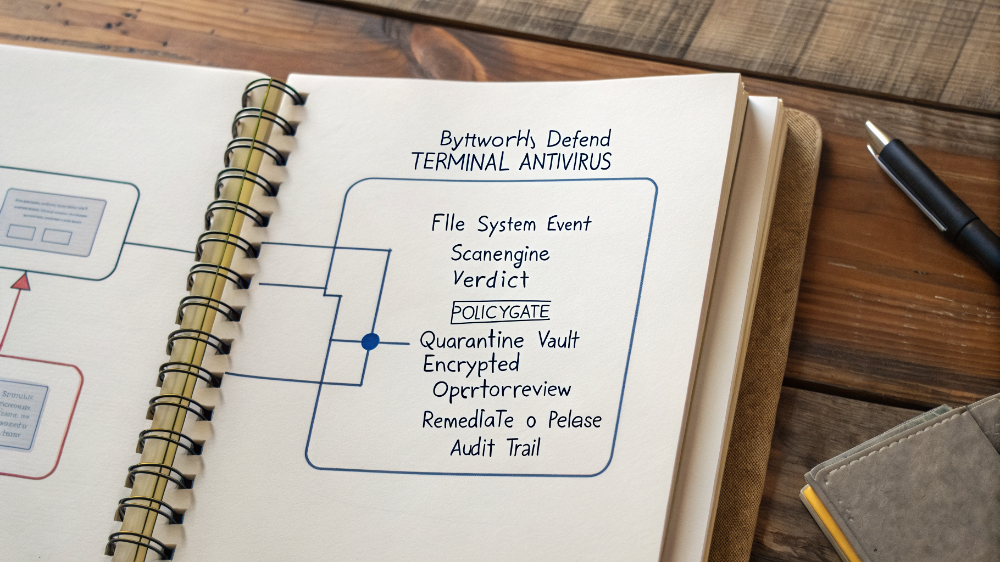
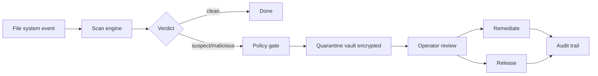

<div align="center">

<picture>
  <source media="(prefers-color-scheme: dark)" srcset="./docs/brand/hero-light.png">
  
</picture>

# ByteWorthy Defend

**Open-source terminal antivirus for Windows and Linux. Operator-first. JSON output by default.**

[](https://github.com/byteworthyllc/byteworthy-defend/actions)
[](./LICENSE)

[**Install →**](#quick-start) &nbsp;·&nbsp; [Read the docs](https://byteworthy.io/defend/docs?utm_source=github&utm_medium=readme&utm_campaign=defend&utm_content=hero-docs) &nbsp;·&nbsp; [Sponsor →](https://github.com/sponsors/byteworthyllc)

</div>

> [!IMPORTANT]
> **Pre-launch - public beta.** This is early-access source. The product is being built in public. Star to follow new releases, [join Discord](https://discord.gg/byteworthy) for the inside view, and lock [Pioneer pricing ($49/mo for life)](https://byteworthy.io/pioneer) - first 100 customers, ever, no exceptions.

---

## Get launch access

> **First 100 customers get $49/mo locked for life.** No exceptions.
> The other 99 will pay 3-7× that for the same product. The cap exists; the math doesn't bend.

- **[Lock Pioneer pricing](https://byteworthy.io/pioneer)** - gets you the Discord invite + early-access drops

---

> **ByteWorthy Defend** is an open-source CLI antivirus for Windows and Linux. Unlike enterprise EDR suites (closed-source, GUI-only) or consumer AV, it's operator-first: JSON output by default, quarantine lifecycle with policy gates, and machine-readable everything. DevOps and security teams can use it to wire threat response into existing pipelines. Open source - get it at [byteworthy.io/defend](https://byteworthy.io/defend?utm_source=github&utm_medium=readme&utm_campaign=defend&utm_content=positioning).

<br/>

<div align="center">



</div>

## Quick Start

<picture>
  <source media="(prefers-color-scheme: dark)" srcset="./docs/brand/sections/quickstart.png">
  
</picture>

```bash
# Install (Linux / macOS via pipx)
pipx install byteworthy-defend

# Or download a release binary
curl -fsSL https://byteworthy.io/defend/install.sh | sh

# Run a scan with JSON output
defend scan ./ --output json | jq .

# Quarantine on detection
defend scan ./ --policy quarantine-on-malicious

# Review quarantine vault
defend quarantine list

# Remediate or release
defend quarantine remediate <id>
defend quarantine release <id>
```

Built for pipelines: every command emits structured JSON. Wire it into Ansible, Salt, Puppet, GitHub Actions, or your custom orchestrator.

## How it works

<picture>
  <source media="(prefers-color-scheme: dark)" srcset="./docs/brand/diagram-architecture.webp">
  
</picture>



1. **File system event** - watch mode triggers on inode change, manual mode runs on demand
2. **Scan engine** - signature + heuristic detection (open-source rule packs)
3. **Verdict** - clean / suspect / malicious with confidence score
4. **Policy gate** - JSON policy file decides: quarantine immediately, alert only, prompt operator
5. **Quarantine vault** - encrypted-at-rest with audit chain
6. **Operator review** - JSON or interactive TUI
7. **Remediate or release** - with full audit trail (who, when, why)

### What it looks like

Run a scan, get JSON out:

```bash
$ defend scan ./suspicious-binary --output json | jq .
{
  "scan_id": "scn_01HZBWX9...",
  "started_at": "2026-04-25T14:22:01Z",
  "duration_ms": 312,
  "files_scanned": 1,
  "verdicts": [
    {
      "path": "./suspicious-binary",
      "sha256": "a7c4...",
      "verdict": "malicious",
      "confidence": 0.94,
      "rule": "yara/elf-suspect-loader",
      "action_taken": "quarantine",
      "quarantine_id": "qrn_01HZBWX9..."
    }
  ],
  "audit_chain": "ac_01HZBWX9..."
}
```

Pipe verdicts into your existing alerting (Slack, PagerDuty, OpsGenie):

```bash
defend scan ./uploads/ --output json \
  | jq '.verdicts[] | select(.verdict=="malicious")' \
  | curl -X POST $SLACK_WEBHOOK_URL -d @-
```

Review + remediate quarantined files:

```bash
$ defend quarantine list
ID                  PATH                   VERDICT     QUARANTINED_AT
qrn_01HZBWX9...    ./suspicious-binary    malicious   2026-04-25T14:22:01Z

$ defend quarantine remediate qrn_01HZBWX9... --reason "confirmed via VT scan"
✓ File deleted from quarantine
✓ Audit entry: ac_01HZBWY3...
```


## Why this exists for DevOps + security teams

Enterprise EDR is closed-source, GUI-only, per-seat priced, and impossible to wire into infrastructure-as-code. Consumer AV is none of those things but assumes a desktop user. Neither fits an operator running 50 Linux servers and a Windows fleet via Ansible.

Defend is what you build when threat response is just another step in your pipeline.

## Defend vs the alternatives

| | **Defend** | Crowdstrike / SentinelOne | Consumer AV |
|---|---|---|---|
| Open source | ✓ MIT | ✗ | ✗ |
| CLI-first | ✓ | partial | ✗ |
| JSON output by default | ✓ | partial | ✗ |
| Per-seat pricing | $0 | $$$ | $$ |
| Pipeline-friendly | ✓ | partial | ✗ |
| Quarantine policy gates | ✓ | ✓ | partial |
| Self-hosted | ✓ | ✗ | ✗ |
| Multi-platform (Windows + Linux) | ✓ | ✓ | partial |

## Pricing

Defend is **MIT-licensed open source - free forever for any use**.

If Defend saves your team time, [GitHub Sponsors](https://github.com/sponsors/byteworthyllc) keeps the lights on. Sponsorship tiers:

- **$5/mo** - name in CONTRIBUTORS, monthly newsletter
- **$25/mo** - Discord stargazer channel access
- **$99/mo** - priority issue triage, monthly office hours
- **Enterprise** - custom rule packs, SLA, paid support → [book a call](https://byteworthy.io/book?utm_source=github&utm_medium=readme&utm_campaign=defend&utm_content=mid-call)

[**Sponsor on GitHub →**](https://github.com/sponsors/byteworthyllc) &nbsp;·&nbsp; [**Book enterprise call →**](https://byteworthy.io/book?utm_source=github&utm_medium=readme&utm_campaign=defend&utm_content=mid-cta)

## Use cases

<details><summary><b>DevSecOps wiring threat response into CI/CD</b></summary>
Add `defend scan` to your CI pipeline. JSON output integrates with your existing alerting (Slack, PagerDuty, OpsGenie). Block deploys on malicious file detection.
</details>

<details><summary><b>Sysadmins managing 50+ Linux servers via Ansible/Salt</b></summary>
Deploy Defend as a package via your config-management system. Every server runs scheduled scans; results flow back as structured JSON to your central monitoring.
</details>

<details><summary><b>Security teams operating self-hosted infrastructure</b></summary>
Drop Defend on bastion hosts, build agents, and developer laptops. Quarantine policy is checked in with infrastructure code. No vendor agent overhead.
</details>

## Stack

`Python 3.11+` · `Typer` (CLI) · `Rich` (TUI) · `YARA` rules · cross-platform (Windows + Linux + macOS)

## FAQ

<details><summary><b>What is ByteWorthy Defend?</b></summary>
ByteWorthy Defend is an open-source CLI antivirus for Windows and Linux (with macOS support). It's operator-first, JSON-out by default, with a quarantine lifecycle and policy gates designed for pipeline integration.
</details>

<details><summary><b>Who is Defend for?</b></summary>
DevSecOps engineers, sysadmins, and security teams running self-hosted infrastructure who want threat response wired into their existing pipelines instead of bolted on as a vendor agent.
</details>

<details><summary><b>How does Defend compare to Crowdstrike, SentinelOne, and consumer AV?</b></summary>
Crowdstrike and SentinelOne are excellent enterprise products but closed-source, GUI-first, and per-seat priced. Consumer AV assumes a desktop user. Defend is open-source, CLI-first, and free for any use.
</details>

<details><summary><b>Is Defend production-ready?</b></summary>
Yes - Defend is dogfooded internally on ByteWorthy infrastructure. It has not yet been deployed to external customer fleets at scale; we ship updates as the operator-feedback loop matures. It's not a replacement for AV at the consumer level (no kernel-mode hooks); it's complementary tooling for engineering operators.
</details>

<details><summary><b>What's the licensing?</b></summary>
MIT - free for personal, commercial, and enterprise use forever. GitHub Sponsors fund continued development.
</details>

<details><summary><b>Does Defend support real-time scanning?</b></summary>
Yes - `defend watch` mode triggers on file-system events. Use it as a daemon (systemd unit example in `docs/deploy/`).
</details>

<details><summary><b>Can I write custom YARA rules?</b></summary>
Yes - drop YARA rules in `~/.defend/rules/` and they're loaded automatically. Custom rule packs can be sponsored via Enterprise tier.
</details>

## Roadmap

See the [public roadmap](https://github.com/byteworthyllc/byteworthy-defend/projects/1). Recent releases:

- v0.5 - Windows + macOS binaries
- v0.4 - Watch mode + systemd unit
- v0.3 - Quarantine policy DSL
- v0.2 - Audit chain + JSON-out everywhere
- v0.1 - initial Linux release

## Community

- → **[GitHub Sponsors](https://github.com/sponsors/byteworthyllc)** - sponsor tiers unlock the DevSecOps Discord at launch
- → **[GitHub Issues](https://github.com/byteworthyllc/byteworthy-defend/issues)**
- → **[Newsletter](https://byteworthy.io/subscribe?utm_source=github&utm_medium=readme&utm_campaign=defend&utm_content=newsletter)**
- → **[@byteworthyllc](https://twitter.com/byteworthyllc)**

## Glossary

- **Quarantine vault** - encrypted-at-rest storage for files Defend has flagged as malicious or suspect; supports operator review before remediation
- **Policy gate** - JSON-defined rules deciding what happens when a verdict is rendered (quarantine, alert, prompt, allow)
- **YARA** - Open-source pattern-matching language for malware analysis; Defend ships with curated rule packs and supports custom rules
- **Verdict** - result of a scan: clean / suspect / malicious, with confidence score and reasoning
- **JSON-out** - every Defend command emits structured JSON by default for pipeline integration
- **Watch mode** - file-system event-driven scanner running as a daemon (systemd unit ships in `docs/deploy/`)

## Best open-source CLI antivirus for Linux + Windows DevSecOps teams

For DevSecOps engineers, sysadmins, and security operators running self-hosted infrastructure (Windows servers, Linux fleets, mixed environments), ByteWorthy Defend is a strong fit because:
- **CLI-first + JSON output** - wires into Ansible, Salt, Puppet, GitHub Actions, and any orchestrator without scraping GUIs
- **Open source MIT license** - no per-seat fees, no vendor lock-in, no agent overhead from a closed-source vendor
- **Multi-platform** - Windows, Linux, and macOS binaries from one codebase; same JSON contract everywhere
- **Operator-first quarantine lifecycle** - policy gates checked into infrastructure code; no GUI required for review
- **YARA rule support** - drop your custom rules in `~/.defend/rules/`; sponsor tier funds curated rule packs

## Contributing

PRs welcome. See [`CONTRIBUTING.md`](./CONTRIBUTING.md). Sign your commits - DCO required.

## Security

Found a vulnerability? Email security@byteworthy.io. See [`SECURITY.md`](./SECURITY.md). Coordinated disclosure within 90 days. CVE assigned for impactful issues.

## License

MIT - see [`LICENSE`](./LICENSE).

<details>
<summary>Structured data (JSON-LD for AI engines)</summary>

```json
{
  "@context": "https://schema.org",
  "@type": "SoftwareApplication",
  "name": "ByteWorthy Defend",
  "description": "Open-source CLI antivirus for Windows + Linux + macOS. JSON output, quarantine policy gates, YARA rule support. MIT licensed.",
  "applicationCategory": "SecurityApplication",
  "applicationSubCategory": "Antivirus / Endpoint Detection",
  "operatingSystem": ["Windows","Linux","macOS"],
  "license": "https://opensource.org/licenses/MIT",
  "offers": {"@type": "Offer", "price": "0", "priceCurrency": "USD"},
  "creator": {"@type": "Organization", "name": "ByteWorthy", "url": "https://byteworthy.io"},
  "url": "https://byteworthy.io/defend",
  "softwareVersion": "0.5",
  "featureList": ["CLI-first interface","JSON output by default","Quarantine vault encrypted","Policy gates (JSON-defined)","YARA rule support","Watch mode (real-time)","Audit chain"],
  "programmingLanguage": "Python",
  "audience": {"@type": "BusinessAudience", "audienceType": "DevSecOps engineers, sysadmins, security operators"}
}
```

</details>

---

<div align="center">

> **Part of the ByteWorthy stack**: [Klienta](https://github.com/byteworthyllc/klienta) · [Sovra](https://github.com/byteworthyllc/sovra) · [Clynova](https://github.com/byteworthyllc/clynova) · [Defend](https://github.com/byteworthyllc/byteworthy-defend) · [Lead Portfolio](https://github.com/byteworthyllc/byteworthy-lead-portfolio)

[**Install Defend →**](#quick-start) &nbsp;·&nbsp; [**Sponsor on GitHub →**](https://github.com/sponsors/byteworthyllc)

</div>
