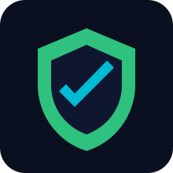

<p align="center">
  
</p>

<h1 align="center">ByteWorthy Defend</h1>

<p align="center">
  <strong>Open-source Windows and Linux terminal antivirus for continuous host protection.</strong>
</p>

<p align="center">
  Continuous scanning controls, quarantine lifecycle, policy-gated remediation,<br/>
  and machine-readable operations from one CLI: <code>bw-defend</code>.
</p>

<p align="center">
  <sub>A <a href="https://byteworthy.io"><b>ByteWorthy</b></a> open-source security project · <a href="https://github.com/ByteWorthyLLC/byteworthy-defend">GitHub</a></sub>
</p>

<p align="center">
  <sub>Maintained in public by the ByteWorthy open-source community.</sub>
</p>

<p align="center">
  <a href="#-quick-start">Quick Start</a>&nbsp;&nbsp;|&nbsp;&nbsp;
  <a href="#-project-site">Project Site</a>&nbsp;&nbsp;|&nbsp;&nbsp;
  <a href="#-why-byteworthy-defend">Why</a>&nbsp;&nbsp;|&nbsp;&nbsp;
  <a href="#-seo--aeo--geo">SEO/AEO/GEO</a>&nbsp;&nbsp;|&nbsp;&nbsp;
  <a href="#-what-you-get">Features</a>&nbsp;&nbsp;|&nbsp;&nbsp;
  <a href="#-command-surface">Commands</a>&nbsp;&nbsp;|&nbsp;&nbsp;
  <a href="#-security-model">Security</a>&nbsp;&nbsp;|&nbsp;&nbsp;
  <a href="#-docs">Docs</a>
</p>

<p align="center">
  <a href="LICENSE"></a>
  <a href="https://github.com/ByteWorthyLLC/byteworthy-defend/actions/workflows/ci.yml"></a>
  <a href="https://github.com/ByteWorthyLLC/byteworthy-defend/actions/workflows/security.yml"></a>
  
  
</p>

<br/>

> **Most endpoint tools either hide internals or skip operator controls.**
> ByteWorthy Defend keeps security actions explicit, auditable, and scriptable.
> Open source, MIT-licensed, Windows-and-Linux.

<br/>

## ⚠️ Disclaimer

- This repository is an open-source security project and research tool, not a managed antivirus service.
- Use is at your own discretion and risk.
- No detection/prevention outcome is guaranteed.
- The software is provided under the MIT License on an `AS IS` basis, without warranty or liability.

## 🚀 Quick Start

```bash
git clone https://github.com/ByteWorthyLLC/byteworthy-defend.git
cd byteworthy-defend
python3 -m venv .venv
source .venv/bin/activate
pip install -e '.[dev]'
bw-defend doctor --strict --json
bw-defend audit verify --json
```

Linux parity from macOS/Windows using Docker:

```bash
docker compose run --rm linux-gate
```

Native Windows validation gate:

```powershell
pwsh -File scripts/windows-gate.ps1
```

Enable AI edition:

```bash
pip install -e '.[ai]'
cp config.example.toml ~/.config/bw-defend/config.toml
# set: edition = "ai"
```

Windows PowerShell config path:

```powershell
Copy-Item config.example.toml \"$env:APPDATA\\bw-defend\\config.toml\" -Force
# set: edition = \"ai\"
```

<details>
<summary><strong>First full verification path</strong> (scan + controls + rules)</summary>

```bash
bw-defend scan /tmp --json
bw-defend quarantine list --json
bw-defend monitor start --json
bw-defend firewall apply --json
bw-defend firewall revert --json
bw-defend monitor stop --json
bw-defend rules verify --json
```

</details>

<br/>

## 🌐 Project Site

Canonical routes:

- Repository: https://github.com/ByteWorthyLLC/byteworthy-defend
- GitHub Pages site: https://byteworthyllc.github.io/byteworthy-defend/
- Trust center: https://byteworthyllc.github.io/byteworthy-defend/trust.html
- Project support policy: https://github.com/ByteWorthyLLC/byteworthy-defend/blob/main/SUPPORT.md

<br/>

## 🔍 Why ByteWorthy Defend

For Windows and Linux security operators, platform teams, and engineering-led security programs:

- Continuous host scanning and deterministic detection workflows
- Reversible quarantine and firewall actions
- Policy-gated remediation that requires approval on destructive actions
- Stable JSON contracts for CI/CD and SOC automation
- Open-source transparency with maintainer quality gates

### ByteWorthy Product Context

ByteWorthy ships a clear product continuum:

1. **Sovra**: open-source AI SaaS baseline
2. **Klienta**: AI workflow project reference
3. **Clynova**: healthcare project reference
4. **ByteWorthy Defend**: open-source Windows and Linux endpoint defense CLI

<br/>

## 🔎 SEO / AEO / GEO

Discoverability and answer-engine assets ship in-repo:

- Root model-retrieval index: [`llms.txt`](llms.txt)
- Site model-retrieval index: [`site/llms.txt`](site/llms.txt)
- Crawl assets: [`site/robots.txt`](site/robots.txt), [`site/sitemap.xml`](site/sitemap.xml)
- Editorial controls: [`docs/marketing-editorial-guidelines.md`](docs/marketing-editorial-guidelines.md)
- Search/answer/generative playbook: [`docs/seo-aeo-geo-playbook.md`](docs/seo-aeo-geo-playbook.md)
- Marketing reference: [`MARKETING.md`](MARKETING.md)

<br/>

## ✨ What You Get

### Core Edition (`edition = "core"`)

- Signature-based scanning engine
- Rule pattern support for `literal`, `regex`, `hex`, and `sha256`
- Quarantine list/restore/purge lifecycle
- Monitor state management (`start|stop|status`)
- Firewall apply/revert lifecycle
- Process visibility and guarded process termination
- Rules update/list/verify with checksum and schema validation

### AI Edition (`edition = "ai"`)

- Remediation planner/executor workflow
- Policy engine enforcement for every action
- Mandatory explicit approval for destructive operations
- Audit records for proposed and executed actions

### Project Quality Layer

- Strict health gate: `bw-defend doctor --strict --json`
- Machine-readable exit codes for CI and automation
- Skylos SAST gate (production code): `skylos src --all --gate --no-upload`
- Dependency audit gate: `pip-audit` policy check in Security workflow
- Supply-chain gate: build artifacts + checksums + SBOM + provenance attestation
- Documentation validation gate: `python scripts/validate-docs.py`
- Release-readiness workflows on GitHub Actions for Windows and Linux
- Windows development gate on `windows-latest`: `scripts/windows-gate.ps1`

<br/>

## 💻 Command Surface

- `bw-defend scan <path|system>`
- `bw-defend monitor start|stop|status`
- `bw-defend quarantine list|restore|purge`
- `bw-defend firewall status|apply|revert`
- `bw-defend process list|kill --pid <id> --approve`
- `bw-defend ai remediate <incident-id> [--approve]`
- `bw-defend rules update|list|verify`
- `bw-defend audit verify [--log-path <path>]`
- `bw-defend doctor [--strict]`

All operational commands support `--json`.

<br/>

## 🛡️ Security Model

- AI never bypasses policy evaluation.
- Unknown remediation actions are denied by default.
- Destructive actions (`delete`, `kill`, `network_block`) require explicit approval.
- Confidence thresholds control non-destructive auto-execution.
- Rules bundles require integrity + schema validation before activation.
- Optional detached signature verification can be enforced for rules bundles.
- Checksum/signature metadata must use valid SHA-256 digests and match target bundle names.
- Every incident/remediation step is audit-logged with tamper-evident chain metadata.
- Optional outbound audit telemetry can stream to a central endpoint.
- Quarantine restore refuses overwrite and purge refuses path-escape entries.
- Scanner and quarantine flows refuse symlink-based file inputs.

### Incident Schema v1

Required fields:

- `id`
- `timestamp`
- `source`
- `artifact`
- `detection_type`
- `severity`
- `confidence`
- `action_state`
- `approval_required`
- `remediation_plan`
- `final_outcome`

<br/>

## 📚 Docs

- [Quickstart](docs/quickstart.md)
- [Command Reference](docs/command-reference.md)
- [Architecture](docs/architecture.md)
- [Deployment Guide](docs/deployment-guide.md)
- [Operations Runbook](docs/operations-runbook.md)
- [Release Process](docs/release-process.md)
- [Release Readiness Checklist](docs/release-readiness-checklist.md)
- [Production Readiness](docs/production-readiness.md)
- [GA Readiness Criteria](docs/ga-readiness-criteria.md)
- [Security Architecture](docs/security.md)
- [Threat Model](docs/threat-model.md)
- [SLO and Reliability Targets](docs/slo-and-reliability.md)
- [CLI Contract v1](docs/contracts/cli-contract-v1.md)
- [Incident Record Schema v1](docs/contracts/incident-record-v1.schema.json)
- [SEO/AEO/GEO Playbook](docs/seo-aeo-geo-playbook.md)
- [Marketing Editorial Guidelines](docs/marketing-editorial-guidelines.md)
- [GitHub Hardening](docs/github-hardening.md)
- [Support and Release Cadence](docs/support-and-release-cadence.md)
- [Docs Index](docs/index.md)

## Release Gate (Maintainer Quality)

A release tag must not be created until all checks in:

- [`docs/release-readiness-checklist.md`](docs/release-readiness-checklist.md)
- [`docs/ga-readiness-criteria.md`](docs/ga-readiness-criteria.md)

are complete with evidence attached.
